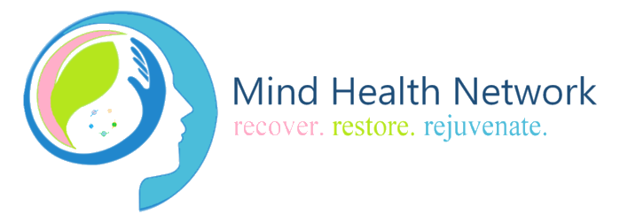

# Mind Health Network(Team Kalolo): ECCE App Challenge 2018

**Team Members**: 
---
* Alice Naphtali 
* Cinye Li
* Kevin Chau
* Alexandar Ristic

**Our team name is derived from the Hawaiian word for brain.**

## Accessing resources:
* Click [here](https://tinyurl.com/y9kk4vdm) for the application.
* Click [here](https://www.youtube.com/watch?v=wn_w3Duw07k&feature=youtu.be) for the video.

## Mind Health Network App
## Team Kalolo | ESRI 2018 ECCE App Challenge

**Mission Statement**

Mental illness is exceptionally common in Canada, with 1 in 5 Canadians experiencing a mental issue every year.1 Such illnesses predominantly affect adolescents between 15-24, with about a quarter of such individuals taking their own lives.2 In the majority of such cases, assistance from health professionals and community-based services can have profound benefits on those suffering from mental health conditions. Yet roughly 75% of the individuals affected have not visited such services.3 This is principally due to the confusing nature of the mental health services available to individuals in Ontario, with many unsure where to begin searching for help, where to go for a particular type of problem, and what types of services are available to them. 

It is of paramount importance to simplify the process of seeking and receiving mental health support in Canada’s most populated city. A free and open service that informs members of the public, especially vulnerable youths, of local mental health services in an accessible and intuitive manner will build effective support networks for those in need. However, as it stands, there is no centralized platform that provides such information. Furthermore, there are no services that categorize a given facility by urgency of the demand (e.g simply seeking information or requiring urgent care) or provide valuable and consistent feedback on the performance of facilities, facility staff, and overall patient satisfaction of the treatments received.

Our application seeks to satisfy these needs by alleviating the burdens of untreated mental illnesses. Mind Health Network provides the public a centralized means of locating mental health services in close proximity to the downtown Toronto core, as well as organizing such locations by urgency. Furthermore, we allow users to  rate the quality of their experiences with a service utilizing a short, 12 question Survey123 form embedded in our application. We hope that this application can be scaled to the provincial level, and even the national level in the future, to extend our platform and mission for a more integrated system of mental health support.

**Our Goals**

The Mind Health Network app strives to connect the citizens of central Toronto to the medical and mental health establishments that best suit their needs, when they need it. To this end, the three main objectives we hope to fulfill are as follows:
 
1.) To improve awareness and promote public education of existing types of mental health facilities, professionals, and services in central Toronto, depending on the urgency level of their mental health condition(s)
 
2.) To connect Torontonians to an extensive network of available mental health professionals and services in the downtown core of the city (encompassing 8 adjacent wards)
 
3.) To provides users with an anonymous platform to inform one another of the quality of a given healthcare service through the completion of a 12-question, 123 Survey

---
**Using the Mind Health Network App**

Preamble

With the Mind Health Network app, we hope to bring an easy, clear, and intuitive navigation system and community-building enterprise with calming visual aesthetics. Users can easily find the services they are looking for alongside all relevant information by the selected urgency of their mental health needs. We designed the Mind Mental Network in such a way as to require very little time for any user to master, especially with our extensive About and How To Widget documentation and customized, user-friendly tool icons embedded in the application. 

The Mind Health Network utilizes ArcGIS Web AppBuilder to build an accessible platform for users from all walks of life.

---
# Steps to Use the App

**Accessing the App**

View the live web app by clicking on the following the link: https://arcg.is/1ubq55 
View a video demoing how to work with the app here: https://www.youtube.com/watch?v=wn_w3Duw07k&feature=youtu.be

*How-To Widget Documentation*

When users first open the Mind Health Network app, they will be greeted by a friendly interface and the unfurled About widget panel on the right. Users may scroll down the panel to read more about the urgency level parameters that help identify their specific type of mental health needs. 

The About widget panel will also include a link to the optional 12 question 123 Survey, which helps to gauge community comments on the quality of mental health services used. There is also another link to the completely confidential and anonymous results of the community-collected information on said mental health services to provide future reference for interested patients or medical providers. Users may also click on the How-To widget, which is located next to the About widget, to learn more about the functionality of each of the tools they can use in this app.

**Search for Mental Health Services by Urgency Level**

With the search widget, users can filter the service they’re looking for by urgency level (Need Help, Need Support, Need Information), the type of service (e.g. Pharmacy, Community Centre etc.) and available days with the provided dropdowns. After submitting their search criteria, the interactive results pane will display a list of relevant locations that meet users’ requirements, and allow users to zoom in and view detailed information on a location-by-location basis.

**Search for Mental Health Services Near You**

Using a slightly modified version of the Near Me widget, users can find locations within a specified radius (1-5 kilometers) of their current location. Users can edit such distances as they desire using an interactive slider and then see a drop-down of all the locations that meet the specified distance criteria.

**Find Directions to Your Chosen Mental Health Facility**

Using the directions, or Where To, widget, a user can specify an origin and destination for a trip, such as to a mental health service, a mode of transportation (car or walking), and time or distance impedance parameters to create a shortest route path between these two points. As well, users have the option to insert waypoints with the add dialog to factor in brief stops towards their final destination. 

*Navigating the Mental Facilities Layers and Sharing!*
If a user desires to look at all available, top-rated mental health facilities in central Toronto, they may click on the Layer List widget and toggle on and off different types of mental health services available in the region. Users may also look to the Legend widget so that they are able to distinguish between the different types of mental health providers, facilities, and services

---
# Data Sources

App Development

The Mind Health Network relies on only free and open data sources that are available online for public use, such as:

* www.ementalhealth.ca
* www.ratemd.com
* www.torontocentralhealthline.ca
* www.yelp.ca/toronto
* www.yellowpages.ca/search/si/1/Telephone+Directories/Toronto+ON
* www.ontario.ca/search/data-catalogue
* www.toronto.ca/city-government/data-research-maps/open-data/
* www.211toronto.ca

As an additional side note, the primary sources of information on pharmacies and other healthcare facilities, such as emergency departments and crisis centres, were taken from the City of Toronto and Province of Ontario’s open databases, as listed above. However, additional information on the top-rated psychologists, therapists, psychiatrists, family doctors, community groups were based off of free, community resources 

## Video Development

PACIFIC SUN by Nicolai Heidlas Music https://soundcloud.com/nicolai-heidlas Creative Commons — Attribution 3.0 Unported— CC BY 3.0 http://creativecommons.org/licenses/b... Music promoted by Audio Library https://youtu.be/kbqmEJTr3nU

## Limitations

* Due to an open data constraint and irregular update schedules, data is current only upto 2016.
* The data only cover 8 central Toronto wards and thus may not fully represent all services in the city.

### References

1.  Smetanin et al. (2011). The life and economic impact of major mental illnesses in Canada: 2011-2041. Prepared for the Mental Health Commission of Canada. Toronto: RiskAnalytica.

1.  Pearson, Janz and Ali (2013). Health at a glance: Mental and substance use disorders in Canada. Statistics Canada Catalogue no. 82-624-X.

1.  Waddell et al. (2005). A public health strategy to improve the mental health of Canadian children.Canadian Journal of Psychiatry, 50: 226-33.

